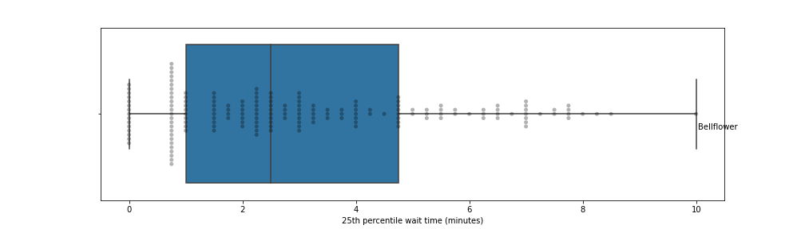
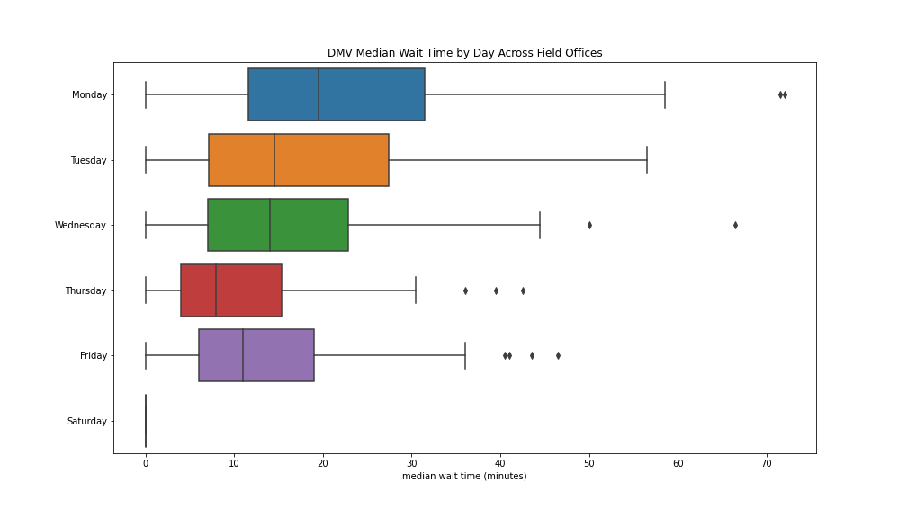

## Get in Line: Waiting Times at the DMV
 
The quality of public services matters a lot. If you have to stand in a long line to [pay your electricity bill](https://www.bbc.com/news/world-asia-india-38088385), as is the norm in some third-world countries, it takes away from the time you have to earn money or the time you have for leisure. If there is trash on the streets, it is not just an eyesore but also potentially a breeding ground for disease. 

In this note, we shed light on an important aspect of quality for one such public service---waiting times at the DMV. We scrape waiting time data from [CA DMV](https://www.dmv.ca.gov/). The DMV site provides average wait times by hour of the day for all the hours for which a facility is open. We use the data to estimate the median average wait time (median of the hourly averages), variation in wait times by day, hour, and the relationship with local sociodemographics. 

### Data

#### DMV Data

CA DMV today provides services in various ways: on the phone, the Internet, partner locations, and field offices. You need to go to the local DMV office for only a small set of important services, or if you have trouble using other methods, e.g., the Internet.    

In all, there are 175 DMV field offices in CA. (There are [178 DMV offices](data/yogov_dmv_list.txt) listed on https://yogov.org/dmv/california/california-dmv-locations/. However, three have closed since yogov compiled their list.)

For each DMV field office, we collected:

1. **name and location:** "name", "street", "locality", "region", and "zip".
2. **wait time (minutes) by hour:** wait time for the Monday 2 pm hour is stored in the column "M14."
3. **services offered:** "title transfers", "licensing services", "replace lost/stolen/damaged", "plates permits & placards", "testing", "records", "registration", "request for miscellaneous original documents."

The final dataset can be downloaded [here](https://github.com/soodoku/wait/blob/master/data/dmv_data_output_12_14_2020.csv). 

**Note** CA DMV does not report over how long a period it averages the wait time. 

To scrape the data, we ran [scripts/get_dmv_wait_data.py](scripts/get_dmv_wait_data.py). The script depends on three pieces of data which we have stored as Python lists:
    * [Office Locales](scripts/ca_locales.py)
    * [Services](scripts/services.py)
    * [Output Column Names](scripts/output_columns.py)

#### Sociodemographic Data

We assume that the patrons for a DMV office are households for which the respective DMV office is the closest. Ideally, we want the sociodemographic composition of the patrons. But that requires us to know where each household is located and the sociodemographics of each household. We can get some of the data on household location from voter files, property records, etc. But still, the data would be incomplete.  And we would need to infer variables of interest like income from the property value of the house, which means our measures will have a fair degree of error. Furthermore, to solve it correctly, we need to construct a distance matrix between households and DMV offices, which is expensive. (Note: we can switch it to a random sample to reduce computational costs.)  We can solve the problem by choosing a more coarse geographical unit for which census data is available and then solve a problem that finds the closest DMV office for each coarse geographical unit, approximated by its centroid. For our first version, however, we choose something yet simpler: sociodemographic data of the field office's zip code gotten via the census API. The data can be downloaded [here](data/ca_census_data/). We pulled it from the ["Age and Sex"](https://data.census.gov/cedsci/table?q=S0101&tid=ACSST5Y2019.S0101), ["Commuting Characteristics by Sex"](https://data.census.gov/cedsci/table?q=S0801&tid=ACSST5Y2019.S0801), and ["Median Income in the Past 12 Months"](https://data.census.gov/cedsci/table?q=S1903&tid=ACSST5Y2019.S1903) tables from the U.S. Census's 2019 [American Community Survey (5-year Estimates)](https://www.census.gov/programs-surveys/acs/about.html). The primary weakness of using this approach is that there is a mismatch between the population of interest (identified in the first sentence) and the quantity we use. 

### Analysis and Results

#### Scripts

* [Descriptive Analysis of DMV Wait Time](DMV.ipynb)
* [Correlations Between Wait Time and Sociodemographics](Sociodem.ipynb)

#### Results

CA DMV, on the whole, seems to be doing an excellent job. The median wait time (median of the hourly buckets) across facilities is around 12 minutes. There are, however, a few field offices, e.g., Hollywood and Temecula, where the median wait time is over 40 minutes.

Yet more reassuringly, the median of the 75th percentile of the wait times is about 20 minutes. The 75th percentile of the 75th percentile is just over 30 minutes. But once again, there are a few offices where the numbers look alarming. For instance, in Temecula, the 75th percentile is nearly 70 minutes.

Plotting the 25th percentile provides a different view. The median of the 25th percentile is around 2.5 minutes. This suggests that the offices are plausibly overstaffed for 25% of the hours as a 2 minute turnaround time means that many people are getting served as soon as they get in, which means that some of the officials are likely waiting for customers. Advanced reservations could explain the short turnaround times, but you have to pair the data above to determine what percentage of people are likely using the advanced reservation system. (It is possible that people who use advanced reservation system book during certain times more often.) 

The larger question is about staffing and what the optimal staffing levels should look like if the objective were to reduce average wait time given fixed resources. There are a few things to consider:

Price of people's time. A [recent paper](http://s3.amazonaws.com/fieldexperiments-papers2/papers/00720.pdf) suggests Value of Time at about $19/hr with variation across cities.)
The number of customers who show up in each time period after they have been informed of the expected wait times.  (Note that by publishing data on wait times, it is likely that CA DMV is already smoothing demand without changing staffing though it is not an optimal way of doing it as there is a concern that the shortest published wait times may see a stampede.) 
Minimum required staffing. It might be the case that a lot of DMVs that have 25 percentile wait times under 5 min are already minimally staffed, i.e., they have one person there who can help during those hours)

The issue of staffing levels becomes more apparent when we plot the wait times by the time of the day and the day of the week. You see really short wait times for after or before office hours (5 pm, 6 pm, and 8 am) followed by hours at the edge of office hour times (4 pm and 8 am). (Though see #3 above.)

Looking at the relationship of wait times and local zipcode sociodemographics, we see modest relationships. For median wait times and average commute time in the zip code, we see a gently rising trend between zip codes with 10 minute average commute times and zip codes with 30 minute average commute times, with the wait times going from a few minutes to 12 or so minutes; the relationship plateaus after that.

The relationship with median income is weaker still---it is roughly flat. 

The only consistent pattern we see is with proportion white, with a relatively sharp drop starting around 65% white. The median wait time goes from about 11 or so minutes to about 5. The net impact per person may be modest but pooled across a community; the lost minutes may be sizable. 

### Future

We plan to explore the following in future versions: 

1. CA DMV website during business hours also provides live wait times. This allows us to build more granular data on wait times. 

2. Join to sociodemographic data of the relevant subset of users of each DMV

3. Collect more data from different states and at future dates to see how the data evolves. 

### Authors 

Noah Finberg and Gaurav Sood

